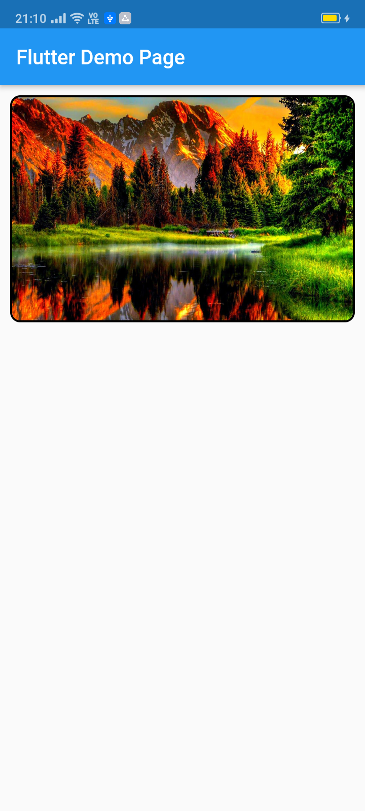

# image_slider

This pub lets you make a widget slider (automatic/manual sliding) with full customization. Mainly intended for image slider, this also accepts all other widgets.

## Screenshots

 

## Usage

[Example](https://github.com/JayTWWM/Image-Slider-Flutter/blob/master/example/example.dart)

To use this package :

* add the dependency to your [pubspec.yaml] file.

```yaml
  dependencies:
    flutter:
      sdk: flutter
    image_slider:
```

### How to use

```dart
ImageSlider(
  /// Shows the tab indicating circles at the bottom
  showTabIndicator: false,

  /// Cutomize tab's colors
  tabIndicatorColor: Colors.lightBlue,

  /// Customize selected tab's colors
  tabIndicatorSelectedColor: Color.fromARGB(255, 0, 0, 255),

  /// Height of the indicators from the bottom
  tabIndicatorHeight: 16,

  /// Size of the tab indicator circles
  tabIndicatorSize: 16,

  /// tabController for walkthrough or other implementations
  tabController: tabController,

  /// Animation curves of sliding
  curve: Curves.fastOutSlowIn,

  /// Width of the slider
  width: MediaQuery.of(context).size.width,

  /// Height of the slider
  height: 220,

  /// If automatic sliding is required
  autoSlide: false,

  /// Time for automatic sliding
  duration: new Duration(seconds: 6),

  /// If manual sliding is required
  allowManualSlide: true,

  /// Children in slideView to slide
  children: links.map((String link) {
    return new ClipRRect(
        borderRadius: BorderRadius.circular(8.0),
        child: Image.network(
          link,
          width: MediaQuery.of(context).size.width,
          height: 220,
          fit: BoxFit.fill,
        ));
  }).toList(),
),
```

# License

    Copyright 2020 Jay Mehta

    Licensed under the Apache License, Version 2.0 (the "License");
    you may not use this file except in compliance with the License.
    You may obtain a copy of the License at

        http://www.apache.org/licenses/LICENSE-2.0

    Unless required by applicable law or agreed to in writing, software
    distributed under the License is distributed on an "AS IS" BASIS,
    WITHOUT WARRANTIES OR CONDITIONS OF ANY KIND, either express or implied.
    See the License for the specific language governing permissions and
    limitations under the License.


## Getting Started

This project is a starting point for a Dart
[package](https://flutter.dev/developing-packages/),
a library module containing code that can be shared easily across
multiple Flutter or Dart projects.

For help getting started with Flutter, view our 
[online documentation](https://flutter.dev/docs), which offers tutorials, 
samples, guidance on mobile development, and a full API reference.

## Example

As time based...

``` dart
import 'package:flutter/material.dart';
import 'package:image_slider/image_slider.dart';

void main() {
  runApp(MyApp());
}

class MyApp extends StatelessWidget {
  @override
  Widget build(BuildContext context) {
    return MaterialApp(
      title: 'Flutter Demo',
      debugShowCheckedModeBanner: false,
      theme: ThemeData(
        primarySwatch: Colors.blue,
        visualDensity: VisualDensity.adaptivePlatformDensity,
      ),
      home: MyHomePage(title: 'Flutter Image Slider Demo Page'),
    );
  }
}

class MyHomePage extends StatefulWidget {
  MyHomePage({Key key, this.title}) : super(key: key);

  final String title;

  @override
  _MyHomePageState createState() => _MyHomePageState();
}

class _MyHomePageState extends State<MyHomePage>
    with SingleTickerProviderStateMixin {
  /// This pub allows you to make image_slider widget and also multiple other useful widgets like walkthrough etc.

  @override
  void initState() {
    super.initState();
    tabController = TabController(length: 3, vsync: this);
  }

  TabController tabController;

  static List<String> links = [
    "https://i.pinimg.com/originals/cc/18/8c/cc188c604e58cffd36e1d183c7198d21.jpg",
    "https://www.kyoceradocumentsolutions.be/blog/wp-content/uploads/2019/03/iStock-881331810.jpg",
    "https://resources.matcha-jp.com/resize/720x2000/2020/04/23-101958.jpeg"
  ];

  @override
  Widget build(BuildContext context) {
    return Scaffold(
        appBar: AppBar(
          title: Text(widget.title),
        ),
        body: Column(
          children: [
            Container(
              margin: EdgeInsets.all(10),
              decoration: BoxDecoration(
                  borderRadius: BorderRadius.circular(10),
                  border: Border.all(width: 2)),
              child: ImageSlider(
                /// Shows the tab indicating circles at the bottom
                showTabIndicator: false,

                /// Cutomize tab's colors
                tabIndicatorColor: Colors.lightBlue,

                /// Customize selected tab's colors
                tabIndicatorSelectedColor: Color.fromARGB(255, 0, 0, 255),

                /// Height of the indicators from the bottom
                tabIndicatorHeight: 16,

                /// Size of the tab indicator circles
                tabIndicatorSize: 16,

                /// tabController for walkthrough or other implementations
                tabController: tabController,

                /// Animation curves of sliding
                curve: Curves.fastOutSlowIn,

                /// Width of the slider
                width: MediaQuery.of(context).size.width,

                /// Height of the slider
                height: 220,

                /// If automatic sliding is required
                autoSlide: false,

                /// Time for automatic sliding
                duration: new Duration(seconds: 6),

                /// If manual sliding is required
                allowManualSlide: true,

                /// Children in slideView to slide
                children: links.map((String link) {
                  return new ClipRRect(
                      borderRadius: BorderRadius.circular(8.0),
                      child: Image.network(
                        link,
                        width: MediaQuery.of(context).size.width,
                        height: 220,
                        fit: BoxFit.fill,
                      ));
                }).toList(),
              ),
            ),
            Row(
              mainAxisAlignment: MainAxisAlignment.spaceEvenly,
              children: [
                tabController.index == 0
                    ? Container(
                        width: 0,
                        height: 0,
                      )
                    : RaisedButton(
                        onPressed: () {
                          tabController.animateTo(tabController.index - 1);
                          setState(() {});
                        },
                        child: Text("Previous"),
                      ),
                tabController.index == 2
                    ? Container(
                        width: 0,
                        height: 0,
                      )
                    : RaisedButton(
                        onPressed: () {
                          tabController.animateTo(2);
                          setState(() {});
                        },
                        child: Text("Skip"),
                      ),
                tabController.index == 2
                    ? Container(
                        width: 0,
                        height: 0,
                      )
                    : RaisedButton(
                        onPressed: () {
                          tabController.animateTo(tabController.index + 1);
                          setState(() {});
                        },
                        child: Text("Next"),
                      ),
              ],
            )
          ],
        ));
  }
}
```
